# Movies-TV-Data---Cleaning-and-Creating
Going through a Movies/TV data set and creating new tables and views. 

## Data
The data is scrapped from IMDb. The dataset can be found at https://www.kaggle.com/datasets/bharatnatrayn/movies-dataset-for-feature-extracion-prediction

The csv downloaded from Kaggle was encountering many issues when trying to import into MySQL Workbench. These problems were fixed by:

1. Upload file to Google Spreadsheets.
2. Download file as XLSX
3. Open XLSX in Excel and save as CSV. 

After this, the CSV had no issues. 

## Built With
MySQL Workbench 8.0 CE
Imported using Table Wizard

## Understanding the Data
The data file comes with 9 columns.
* Movies : The title of the Movie/Show
* Year : The Year released-ended. 
* Genre : The genre(s) of the Movie/Show
* Rating: The rating for the listed Movie/Show
* One-Line: Single line disctription of the Movie/Show
* Stars: List of notable Actors/Directors
* Votes: Number of votes recieved on IMDb. 
* RunTiime: Movie/Show runtime
* Gross: Earnings ( many of the rows have this empty sadly )

All the columns aside from One-Line and RunTime were used. 

### Minor Data Fixes
The Year column uses both "-" and "–". Which is very difficult to see the differnce between and took me some time to realize. 
Once I realized this, I switched all instances of "–" with "-". Leading white space was also cleared from Movies so that there won't be issues with grouping.

## Description of all created tables
Each of the tables were created by grouping Movies and Year. This way in the event that a two movies have the same title, we can distinguish them. 

#### CinemaAiringYears
By using the Years column, we can put the Movies into three categories. 
1. Single Series/Movie: A movie or a show that only had one season. And thus, only aired for one year. Ex ( - 2009 )
2. On Going: A serires that has not ended year. EX ( 2012 - )
3. Series Concluded: Series has Start and End date. EX ( 2012 - 2014 )

After determing a category, the data is split between start and end dates. For a Single Series/Movie the release year is set to equal the end year.

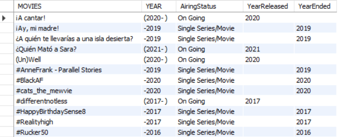

#### CinemaRatings
The rows are grouped by Movies/Year and the Min, Max, and Avg rating are added created. Those without a rating use N/A instead. 

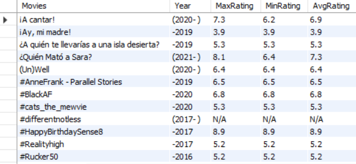

#### CinemaActors and CinemaDirectors are different tables but created using the same process.
The data in the Stars column uses a " Star(s): Name, Name, Name | Director(s): Name, Name" format.
This made it difficult to work with and required a few temp tables to make things easier. 

The first temp table (tempStar1) splits the Stars and Directors into seperate columns. Then leaves only the names:
TempStar2 simply uses a GROUP_CONCAT to group using "unique" names for Actors and uses commas to delimit them.

The returning Actors names will show an Actor name more than once if they were in different rows as long as different names where also included.
"Name1, Name2" and "Name1" are not unique and thus will return "Name1, Name2, Name1". 

In order to fix this severel regex expressions were used. After deleting whitespace and replacing commas with whitespace, A regex expression was used to remove 
a name that already appeared in the string. A comma was then added between each name. 

The returning column is a clean list of Actors for each movie. This same process is done for Directors. 

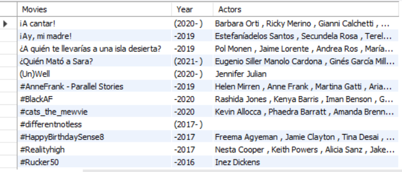

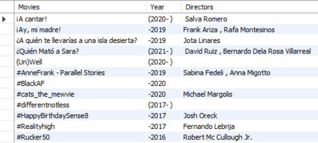

#### CinemaVotes
This table gets the sum of votes afer casting the column to an int.

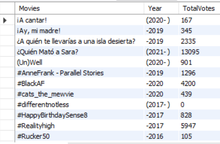

#### CinemaGross
As the GROSS column is not a numeric column. A seperate column was created by converting the column to decimal and finding the sum of the group.
This is the TotalNumericGross. The TotalGross column adds a $.

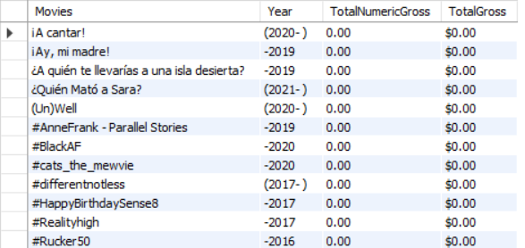

#### CinemaGenre 
This table follows a similar process to CinemaActors and CinemaDirectors. A temptable is created the same way except this time on Genre column.
Then uses similar regex expressions to get the true unique Genres. 

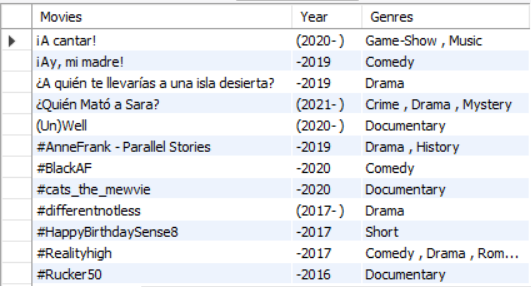

### EACH OF THESE CAN BE DOWNLOADED FROM CinemaTables.zip

## Views Created
After creating the tables, I created views to extract certain information. Each of these views can be found in the CinemaViews.zip

* LongestConcludedSeries: Concluded Series that ran the most years 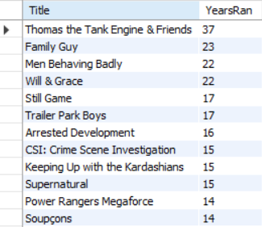
* HG_After_2012: Movies/TV Shows with the highest GROSS released after 2012  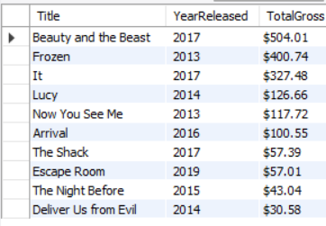           
* RomComs: On Going RomComs with the Highest Average Rating  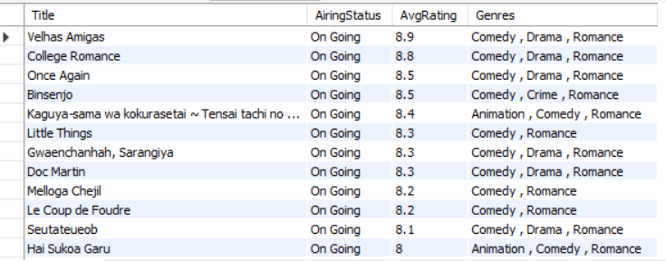
* Actors_Directors: Shows the movies when there are at least 4 more actors than directors so long as the number of directors is not 0. 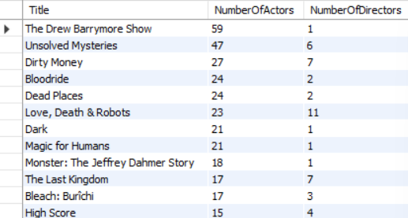    
* AD: Unions the Actors and Directors, creates NotablePeople column  
* QT_ZS_Votes: Quentin Taratino and Zack Snyder films in order of TotalVotes  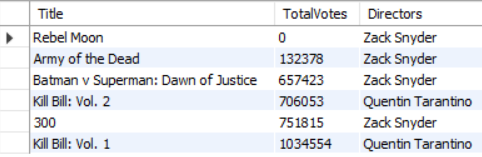

